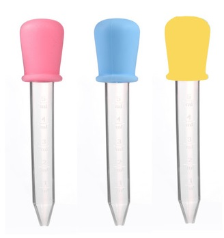

# 低龄宝宝如何喂药？

宝宝平时有轻微感冒等症状，医生一般不建议直接输液或打针，而是优先吃一些冲剂或者口服液，但这时候的宝宝大多还无法有效沟通，也忍受不了药的苦味，喂药会是个麻烦事儿，如果方法不当，强行灌药很容易因为宝宝抗拒或哭引发呕吐、呛鼻子等情况。

本文档列出给低龄宝宝使用滴管喂药的一些技巧：

## 滴管喂药的技巧
   
1. 喂的时候宝宝会哭和挣扎是不可避免的，不要怕他哭，这反而有利于喂药。但至少需要多一个人协助控制住宝宝的身体和头部，使其不要乱晃且保持稍微后仰。

2. 要注意滴管挤药的节奏，要在他一口气哭到的时候把滴管伸到嘴里，在他一口气哭尽、马上要换气的时候快速把药挤进去，这样宝宝就会因为换气完全咽下去，不会被他吐出来，也不容易引发呕吐。
   
3. 挤药的时候**不要直接对着喉咙挤**，这样很容易呛到，要朝向他的牙齿根部位置挤，让他自己咽下去（需要他的头略微后仰）。这个节奏就在一呼一吸之间，没那么容易掌握，最好自己先模仿小孩哭的感觉，对着自己的嘴喂一下，体会一下挤药节奏和位置。

4. 常用的滴管如下图所示，头部滴管略硬，可以保证宝宝咬住之后也能挤出来，但要注意手稍稍按着他的下巴，防止他用力过度咬碎滴管。

5. 一般吸一次只有2.5ML左右，建议吸完倒过来让药液进入尾部，按住气囊再吸一次，这样一次至少喂5ML，就可以用较少的次数快速完成喂药（一般药的剂量不会超过20毫升），否则喂得太慢宝宝越哭越凶，不利于操作。

6. 宝宝习惯这种方式之后可能不会一上来就哭，而是鼓着嘴巴等着你挤药之后再吐出来，这时候可以先稍微挤一点（但滴管不要从嘴里拿出来），让他尝到苦味但又吐不出来，又开始哭的时候再按照以上技巧进行。

    
  
## 喂药后的安抚
   
喂完药不要马上给宝宝喝奶，因为他嘴里还有苦味，会以为奶水也是苦的，从而可能对奶粉产生排斥心理。
   
可以在喂药之前先准备15ML的果汁（如梨汁、橙汁），喂完药之后再喂几管果汁，冲淡嘴里的苦味，然后再吃些零食或喂奶来安抚。

## 其他注意事项
1. 不要尝试把药剂或口服液加到奶粉里面，药的味道一般都很冲，宝宝都能喝出来的，让他对奶粉产生排斥了反而更不好。

2. 最开始宝宝不适应，可能有呕吐现象，一般一两次之后就能适应了。还有就是要在下巴下面点上纸巾或围嘴，有漏出来的药及时清理。

<!-- 添加正面案例（不超过3个），如没有则保留<无>占位符 -->
## 正面案例

我家的宝宝两次之后就喂得很顺利了。

另外小葵花口服液的味道比较甜，我们家宝宝喝了几次就喜欢上喝了，就不用费力喂了，但别的药剂大多比较苦，必须得强制喂。

<!-- 添加反面案例（不超过3个），如没有则标记<无>占位符 -->
## 反面案例

我同学家的宝宝因为一直没有掌握好喂药技巧，直到两岁半都还没办法吃药，只能打针或者输液，用了以上方法后也能成功喂药了。

<!-- 来自子女的看法，如没有则标记<无>占位符 -->
<!-- 注意：这一部分意在反映子女的具体反馈，默认应该由未成年子女补充，或由家长收集子女的反馈来填写，家长不要根据自己的想法填写。-->
## 子女有话讲
<无>

## 参考文献或链接
<无>